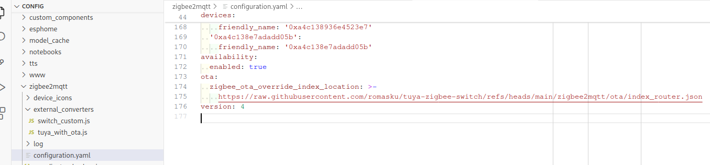

# How to Flash via OTA  

**IMPORTANT**  
This process may brick your device, as it has not been extensively tested. Be prepared to use a hardware flasher to restore your device if needed. Although it worked fine for me, I want to warn you about the potential risks.  

To follow these instructions, you need **zigbee2mqtt** installed. If you're using **ZHA**, you'll need to do your own research (you can start [here](https://github.com/pvvx/ZigbeeTLc/issues/7)).  

### Step 1: Download the Necessary Files  
- [Converter for the original device](https://github.com/romasku/tuya-zigbee-switch/raw/refs/heads/main/zigbee2mqtt/converters/tuya_with_ota.js)  
- [Converter for custom firmware](https://github.com/romasku/tuya-zigbee-switch/raw/refs/heads/main/zigbee2mqtt/converters/switch_custom.js)  

Place these files into `external_converters` subfolder of zigbee2mqtt data folder. If `external_converters` folder doesn't exists, create it.

### Step 2: Update the Configuration  

Choose if you want to use Router of EndDevice version of the firmware. Router device responds faster to requests, can increase Zigbee network strength, but can be unstable on no neutral device as it consumes more power. You can try both options, but it requires [a special OTA update](./change_device_type.md) to change the type. 

Add the following code to the `configuration.yaml` file of zigbee2mqtt for Router firmware:  

```yaml
ota:
  zigbee_ota_override_index_location: >-
    https://raw.githubusercontent.com/romasku/tuya-zigbee-switch/refs/heads/main/zigbee2mqtt/ota/index_router.json
```

Or the following code to the `configuration.yaml` file of zigbee2mqtt for EndDevice firmware:  

```yaml
ota:
  zigbee_ota_override_index_location: >-
    https://raw.githubusercontent.com/romasku/tuya-zigbee-switch/refs/heads/main/zigbee2mqtt/ota/index_end_device.json
```


### Step 3: Verify the Configuration  

If everything is set up correctly, you should see something similar to this:  

  

### Step 4: Flash via OTA

Restart zigbee2mqtt. Now device should appear in the OTA tab. Click "Check for new updates" and then proceed with the update.  


### Step 5: Rejoin the Device  

Once the device is flashed, it should re-connect automatically. After it connected, please re-interview (press small "i" button on the device page) and reconfigure it (small "arrows loop" button next to re-interview button). This allows Z2M to adapt to change of device capabilites.

If device doesn't rejoin, please force delete the old device from zigbee2mqtt and open your network by pressing "Permit join". Then reset the device by pressing any switch 5 times in a row fast. The device should join your network.  

---

Hopefully, you now have a working device with custom firmware! 😊  