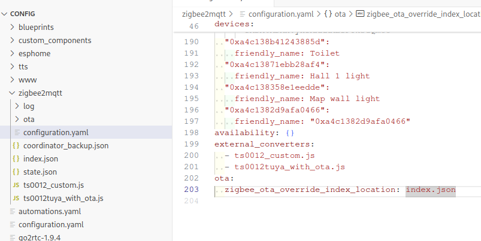

# How to Flash TS0012 via OTA  

**PLEASE AVOID FLASHING VIA OTA UNTIL https://github.com/romasku/tuya-zigbee-switch/issues/1 resolved**

**IMPORTANT**  
This process may brick your device, as it has not been extensively tested. Be prepared to use a hardware flasher to restore your device if needed. Although it worked fine for me, I want to warn you about the potential risks.  

To follow these instructions, you need **zigbee2mqtt** installed. If you're using **ZHA**, you'll need to do your own research (you can start [here](https://github.com/pvvx/ZigbeeTLc/issues/7)).  

### Step 1: Download the Necessary Files  
- [Converter for the original device](https://github.com/romasku/tuya-zigbee-switch/raw/refs/heads/main/zigbee2mqtt/converters/ts0012tuya_with_ota.js)  
- [Converter for custom firmware](https://github.com/romasku/tuya-zigbee-switch/blob/main/zigbee2mqtt/converters/ts0012_custom.js)  
- [Custom index of OTA updates](https://github.com/romasku/tuya-zigbee-switch/raw/refs/heads/main/zigbee2mqtt/ota/index.json)  

Place all three files in your zigbee2mqtt data folder.  

### Step 2: Update the Configuration  

Add the following code to the `configuration.yaml` file of zigbee2mqtt:  

```yaml
external_converters:
  - ts0012_custom.js
  - ts0012tuya_with_ota.js
ota:
  zigbee_ota_override_index_location: index.json
```

### Step 3: Verify the Configuration  

If everything is set up correctly, you should see something similar to this:  

  

### Step 4: Flash via OTA

Restart zigbee2mqtt. Now TS0012 should appear in the OTA tab. Click "Check for new updates" and then proceed with the update.  


### Step 5: Rejoin the Device  

Once the device is flashed, force delete the old device from zigbee2mqtt and open your network by pressing "Permit join". The device should automatically rejoin.  

If you miss the moment when the OTA update finishes and the device doesn't rejoin (there is a timeout for join retries), try pressing the reset button on the device for more than two seconds.  

---

Hopefully, you now have a working device! 😊  