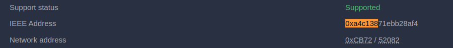
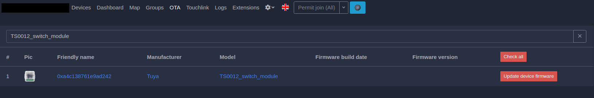

# How to Port Firmware to a New Device  

This guide describes how firmware can be adapted to other switches or patched to work properly if a device partially misbehaves.  

## Requirements
- supported microchip
- pinout
- OTA cluster (otherwise flash by wire)
- Zigbee manufacturer (_TZ3000_abcdefgh)
- stock converter model
- imageType and manufacturerCode

## Verify That the Device Uses the Correct Controller Module  

The firmware works on the TLS8258 microchip, which is the heart of Tuya-branded modules [ZT series modules](https://developer.tuya.com/en/docs/iot/zt-series-module?id=Kaiuym8ctid7k):  
- ZT3L  
- ZTU  
- ZT2S  
- ZTC  
- ZT5  

This can be checked in Z2M by verifying the device IEEE (MAC) address. It should start with `0xa4c138`:  

  

Alternatively, you can open your device and check for such a module. It should look like this:  

  

**IMPORTANT**  
The firmware will not work for non-Telink devices, and trying to apply the steps below to other devices will almost certainly break your device.  

## Enable OTA Support for Stock Firmware  

Tuya devices come with OTA support, but this is disabled and hidden from Z2M as there are no OTA updates publicly available for them. To flash the device via OTA, you'll need to enable it.  

First, find the device "model" name from the Z2M interface:  

  

Then download the [converter for the original device](https://github.com/romasku/tuya-zigbee-switch/raw/refs/heads/main/zigbee2mqtt/converters/tuya_with_ota.js) and place it into the `external_converters` subfolder of your Zigbee2mqtt data folder. If the `external_converters` folder doesn't exist, create it.  

Then modify the `tuyaModels` list to include your model. If it is already there, just skip this step.  

  

Now you can restart your Z2M and verify that your device is visible in the OTA tab.  

  

If your device is not visible, it might be a rebranded model.  
Search this file for your Zigbee manufacturer (_TZ3000_abcdefgh): [devices/tuya.ts](https://github.com/Koenkk/zigbee-herdsman-converters/blob/master/src/devices/tuya.ts) and use the original model name you find there.  
```
fingerprint: tuya.fingerprint("TS0003", ["_TZ3000_4o16jdca", "_TZ3000_odzoiovu", "_TZ3000_hbic3ka3", "_TZ3000_lvhy15ix"]),
model: "TS0003_switch_module_2", <-- this one
vendor: "Tuya",
```
Also check the Z2M logs to see if the converters were loaded.

## Prepare OTA Index  

Now that Z2M recognizes that the device can be updated via OTA, you need to provide it with a file to flash. Z2M uses JSON index files for this.  

Add a custom index as described in [updating.md](./updating.md). Then open this index file in a text editor and find the entry for the device that is most similar to your device. Replace the `manufacturerName` list with the "Zigbee Manufacturer" value from the Z2M device info screen. It should be something like `_TZ3000_...`. Save the file, restart Z2M, and check for updates for your device in the OTA tab.  

If Z2M shows that OTA is available, you are ready to proceed.  

If the update is not available, this may mean that the device uses a non-standard `imageType` and `manufacturerCode`. Enable logs and look for messages like the following (search for `manufacturerCode`):  

```
[2025-01-18 16:37:38] debug: 	zh:controller: Received payload: clusterID=25, address=44312, groupID=0, endpoint=1, destinationEndpoint=1, wasBroadcast=false, linkQuality=160, frame={"header":{"frameControl":{"frameType":1,"manufacturerSpecific":false,"direction":0,"disableDefaultResponse":false,"reservedBits":0},"transactionSequenceNumber":79,"commandIdentifier":1},"payload":{"fieldControl":0,"manufacturerCode":4417,"imageType":43521,"fileVersion":16986117},"command":{"ID":1,"response":2,"parameters":[{"name":"fieldControl","type":32},{"name":"manufacturerCode","type":33},{"name":"imageType","type":33},{"name":"fileVersion","type":35}],"name":"queryNextImageRequest"}}
```  

When you see such logs, please open an issue, as updating your device will require a customized OTA header.  

**IMPORTANT**  
Flashing firmware via OTA may break your device. Fixing it will require soldering some wires and flashing the device via UART. Proceed with caution.  

## Setting Up the Device After Update  

First, install the [converter for custom firmware](https://github.com/romasku/tuya-zigbee-switch/raw/refs/heads/main/zigbee2mqtt/converters/switch_custom.js) to control the reflashed device. This is done the same way as for the converter for stock firmware.  

If everything goes correctly, the device will reboot and rejoin after the update. If it reboots but doesn't rejoin, wait at least 5 minutes, then try removing it from Z2M and resetting it by long-pressing the reset button or pressing a switch multiple times quickly. If nothing works, you'll need to disassemble the device and flash it by wire.  

If everything is set up correctly and the device appears in Z2M, re-interview it just to be sure, and then open the "Exposes" tab. You'll need the "Device Config" text field. This field specifies the device model, manufacturer, and GPIO pin setup of your device, e.g., how the switches, relays, LEDs, and buttons are connected to the ZT module. The format is as follows:  

```
<device manufacturer name>;<device model name>;<pin setup 1>;<pin setup 2>;...;<pin setup n>;
```  

The string is a list of entries separated by `;`. The first two entries specify the "manufacturer name" and "model name." Each command then sets the function of a single pin.  

Pin setup entries start with one of the following characters:  
- `B`: Onboard reset button  
- `L`: Onboard LED  
- `S`: Switch  
- `R`: Relay  
- `I`: Indicator LED (for switches that have per button led)
- `i`: Change image_type for OTA (to migrate device to firmware for another device)  
- `M`: Force momentary mode and hide this setting from Z2M. Usefull for devices that are complete switches, i.e. have buttons built-in.

Next, two characters specify the pin name, e.g., `A4` or `C2`, as described in the [Tuya docs](https://developer.tuya.com/en/docs/iot/zt-series-module?id=Kaiuym8ctid7k).  

For buttons (`B`) and switches (`S`), the next character determines the pull-up/pull-down resistor:  
- `u`: Up 10K  
- `U`: Up 1M  
- `d`: Down 100K  
- `f`: Float  

If unsure, use `u` or `U`. `f` may cause fake clicks, and the device can get stuck in a boot loop, so use it only if you are sure.  

For LEDs, add `i` to invert the state.

As some Relays are bi-stable and use two pins to control, where one pin turns it on and another one turns it of, it is possible to specify
second pin like this: `RC2D2;`

Here is an example config:  

```
Tuya-WHD02-custom;WHD02-custom;BB4u;LD3;SB5u;RB1;
```  

The manufacturer is `"Tuya-WHD02-custom"`, the model is `"WHD02-custom"`, `BB4u` means a reset button on pin `B4` with a 10K pull-up (`u`), `LD3` specifies an onboard LED on pin `D3`, `SB5u` specifies a switch on pin `B5` with a 10K pull-up, and `RB1` specifies a relay on pin `B1`. This describes a device with a single switch and a single relay.  

Here is an another example config:  

```
Example-switch;Example-switch;SB5u;RC2D2;ID3;
```  

In this example we have no on-board led and no on board reset button, only one switch on pin `B5`, with bi-stable relay controlled by pins `C2` and `D2`, and indicator led on pin `D3`.

Try updating the config with different pins until the device works properly. You can either guess the pins (e.g., a 4-gang model may use the same pins as a 3-gang model plus two additional pins that are neighbors on the ZT module) or trace the pins using a multimeter.  

## Update Custom Adapter  

To see all buttons and relays in Z2M, you'll need the proper converter. Devices with the same number of switches use the same converter, so you can copy an existing one and then change the `zigbeeModel` to work with your device.  

If you manage to port your firmware, please create an issue or even a PR with your findings so that newcomers can benefit!  

Thank you for trying this firmware!  
