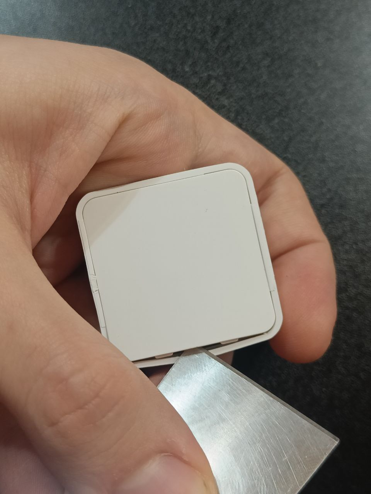
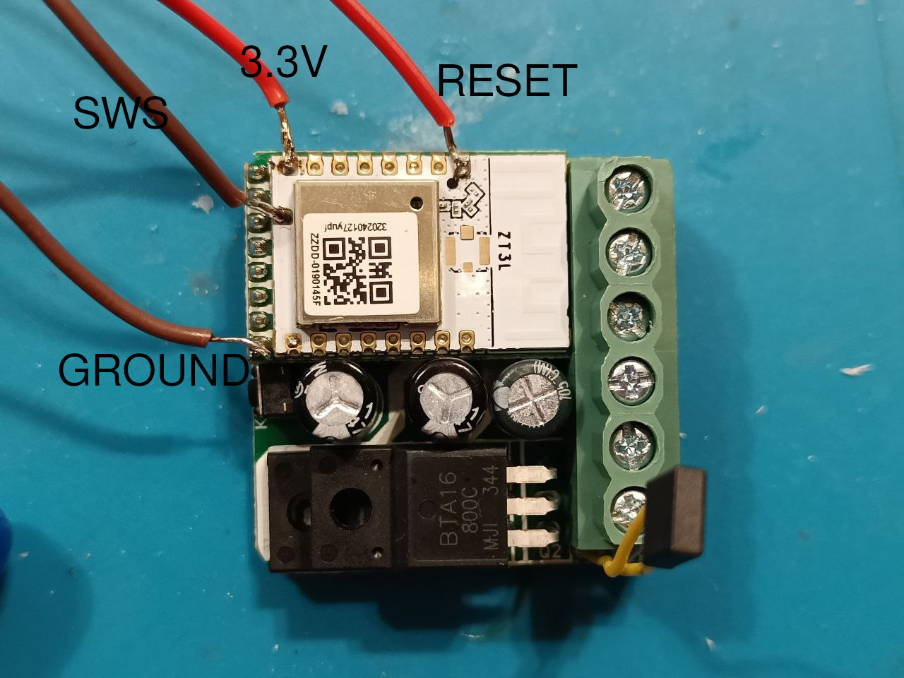

# How to Flash TS0012 via Wire

### What You'll Need

- A UART programmer (preferably one with an exposed RTS pin). I used the FT232RL.
- A soldering iron
- Some spare jumper wires

### Step 1: Disassemble the Device

Unplug the device from the mains. **Never attempt to disassemble it while it is plugged in!**  

Start by removing the back cover. Use any flat object to pop it off.  

  

Next, remove the board from the case by pushing on the screws; it should come out easily.

### Step 2: Solder the Wires

You’ll need to solder four wires as shown in the photo:  

  

The RESET wire is optional if your UART programmer lacks an RTS pin. It may work without it, but having it is preferable.  

Attach the wires to your UART as follows:  
- **3.3V** to **3.3V**  
- **Ground** to **Ground**  
- **SWS** to the **TX pin** of the programmer  
- **Reset** to the **RTS pin** of the programmer  

### Step 3: Flash the Firmware

Download the [full firmware](https://github.com/romasku/tuya-zigbee-switch/raw/refs/heads/main/bin/tlc_switch.bin).  

Plug the UART into your PC, then open pvvx's [web flasher](https://pvvx.github.io/ATC_MiThermometer/USBCOMFlashTx.html).  

1. Select Baud **1500000** (for faster flashing), click "Open," and choose your UART port.  
2. Click "Choose file" and select the firmware you downloaded.  
3. Click "Erase All Flash" and wait until the process finishes.  
4. Click "Write to Flash" and wait until the process finishes.  

If done correctly, the onboard LED will start flashing automatically. You can try joining the device to a Zigbee network to verify that it connects properly. Once confirmed, disconnect everything, unsolder the wires, and reassemble the case.  
